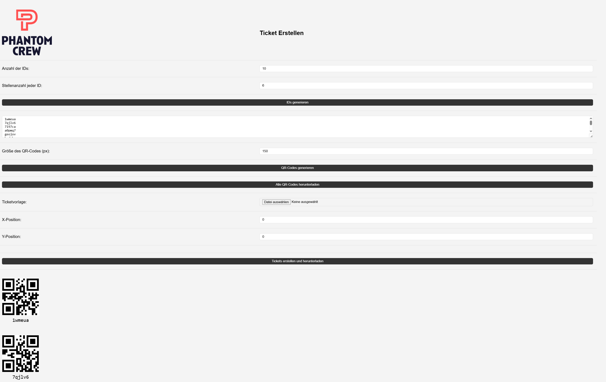

## 🎟️ QR Ticket Generator

A simple, browser-based tool for generating unique QR codes, placing them on a ticket template image, and downloading them as individual PNG files or bundled in a ZIP. No installation required – works entirely client-side.

### 🚀 Features

* Generate secure random IDs
* Create QR codes for each ID
* Position QR codes on a custom background image
* Download all QR codes or ready-to-use ticket images
* Fully offline capable after loading once

### 🖼️ Interface Preview

 <!-- Replace with a real screenshot -->

---

### 📦 How to Use

1. **Clone or Download**

   ```bash
   git clone https://github.com/yourusername/qr-ticket-generator.git
   ```

   Or simply open `Ticketgenerator.html` in your browser.

2. **Set Parameters**

   * Choose the number of IDs and length
   * Click “Generate IDs” or insert your own

3. **Generate QR Codes**

   * Adjust QR size if needed
   * Click “Generate QR Codes”

4. **Upload Ticket Template**

   * Upload a PNG ticket image
   * Click anywhere on the image to define QR position

5. **Download**

   * Download QR codes separately
   * Or click “Create and Download Tickets” to get complete tickets

---

### 📁 File Structure

```text
.
├── Ticketgenerator.html                       # Main application
├── cropped-Phantomcrew-Logo-ohne-Claim.png    # Logo file (optional)
└── preview.png                                # (Add a screenshot for visual reference)
```

---

### 🛠️ Built With

* [HTML5 & CSS3](https://developer.mozilla.org/)
* [JavaScript (Vanilla)](https://developer.mozilla.org/en-US/docs/Web/JavaScript)
* [QRious](https://github.com/neocotic/qrious) – QR code generation
* [JSZip](https://stuk.github.io/jszip/) – ZIP creation
* [FileSaver.js](https://github.com/eligrey/FileSaver.js) – Save files client-side

---

### 📄 License

MIT License – feel free to use, modify, and share.


## 🤝 Author

Made with ❤️ by Julius – [phantomcrew.de](https://phantomcrew.de/)
